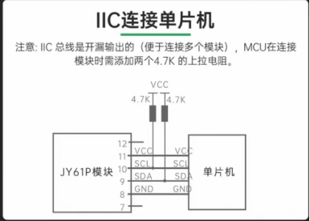

## F407ZGT6工程temp

### 引脚清单

1. 陀螺仪(JY61P)

   I2C1

​	SCL:PB6  

​	SDA:PB7

​	VCC:3.3-5V

​	注意要添加上拉电阻

​	 

2. 电机驱动 tb6612FNG

​	PWMA:PE9

​	PWMB:PE11

​	VM:4.5-10V 越大越好，保证动力足够

​	AIN1:PC4

​	AIN2:PC5

​	BIN1:PB0

​	BIN2:PB1

3. 四个按键

​	引脚:PF2-PF5  四个

​	另一端接地就行

4. 八路循迹

​	引脚: PE0-PE7 八个

5. 无线串口

​	 TX------接单片机的PA10

​	 RX------接单片机的PA9

6. OLED屏幕

​	SCL接PF1  SDA接PF0

7. 编码器
   1. TIM2
      1. CH1-> PA0
      2. CH2 -> PA1
   2. TIM3
      1. CH1-> PA6
      2. CH2 -> PA7

